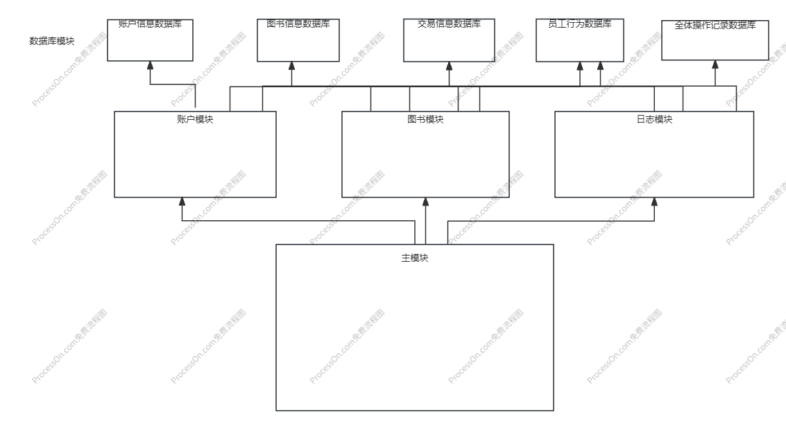

Bookstore 总体分析文档

陈奕珲

程序功能概述：
该程序模拟了一个书店系统，能够面向三类人员：顾客、销售人员和店长，并以文件的方式存储图书、账户和日志相关信息，支持注册账户、登录账户、查询书籍信息、购买书籍、修改书籍信息、查询盈利信息、员工行为记录等。

主体逻辑说明：

前端：

首先，用一个while循环接收用户指令，当接受到quit/exit时退出系统。

循环体中：

维护一个登录栈，按登录顺序存储当前所有登录系统的账户。

账户相关指令：在账户数据库中查询相关信息（以及进行修改）

图书相关指令：根据用户输入信息在图书数据库中查询并修改

日志系统：实现以下两个类：员工行为、交易信息。在日志相关信息数据库中维护交易信息记录，所有操作的记录，并对每位员工维护一个员工行为记录（按操作时间排序）。

代码文件结构：

main函数可以调用database命名空间中的BlockChain类，Blockchain类可以调用MemoryRiver类实现文件IO.

每个BlockChain对象对应一个数据库。

维护图书信息类，账户信息类，员工行为类，交易信息类。
为对每种数据库操作实现一个函数，访问对应数据库。

在main函数的while循环体中处理指令。

功能设计：

数据库模块：维护账户信息、图书信息、员工行为记录、交易信息、全体操作记录五个数据库。

账户模块：处理账户相关指令，调用账户信息，员工行为记录，全体操作记录数据库。

图书信息模块：处理图书相关指令，调用图书信息，员工行为记录、交易信息，全体操作记录数据库。

日志模块：处理日志相关指令，调用员工行为记录、交易信息、全体操作记录数据库。
主模块：维护登录栈，用while循环接受用户指令，可以调用上面三个模块并输出结果。

数据库设计：

账户信息数据库：存储账户信息类，按用户名字典序排序

图书信息数据库：存储图书信息类，按图书ISBN号字典序排序

员工行为记录数据库：存储员工行为类，以员工用户名为第一关键字排序，然后每位员工的行为按操作时间排序。

交易信息数据库：存储交易信息类，按交易时间排序。

全体操作记录类：存储操作记录类，按操作时间排序。

类设计：

账户信息类：包括用户名，密码，权限

图书信息类：包括图书的ISBN号，书名，关键字，存货，单价

全体操作记录类：基类，包括操作时间，操作类别，子类为员工行为记录类和交易信息类。

员工行为记录类：包括员工用户名，操作时间，操作类型（buy,select,modify,import,useradd,delete）,具体信息。

交易信息类：包括交易金额（正为收入，负为支出）和交易时间。

