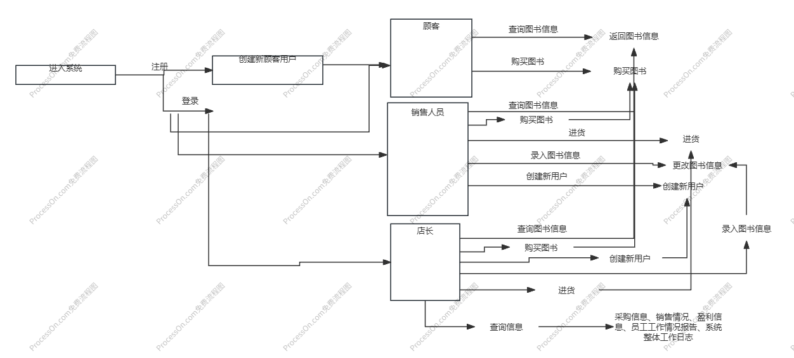
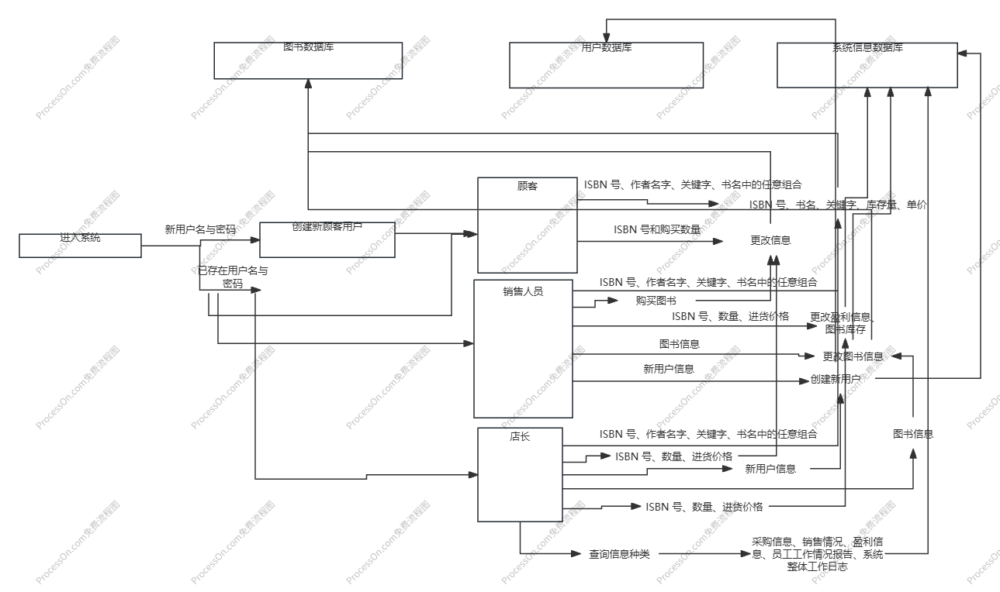

业务流图

数据流图

数据词典

用户信息：包括用户名、密码、用户权限（顾客/销售人员/店长)

图书信息：包括ISBN 号（20 个字符，每本正版书都有惟一的标识）、书名（60 个字符、作者（60 个字符）、关键字（可以有多个，总共不超过 60 个字符）、库存量（整型）、单价（非负实数）

收入：用户购买的图书的价格之和

支出：进货的图书的价格之和
利润：收入-支出

采购信息：按照采购顺序输出采购图书的图书信息

销售情况：按照销售顺序输出售出图书的图书信息

盈利信息：该段时间的收入，支出以及利润

员工操作类型（以及对象）：
查询图书（图书信息）、购买图书（图书信息）、进货（图书信息、进货量以及价格）、录入图书信息（图书信息）、创建用户（用户信息）。

员工工作情况报告：按操作顺序输出每次操作类型及其对象，如创建用户操作以及对应的用户信息

系统整体工作日志（系统信息）：包括采购信息、销售情况、盈利信息、员工工作情况报告所有

功能说明：

模块1： 查询/修改模块

    功能1：查询图书信息、部分图书信息、图书信息、在数据库中查找所有符合条件的图书
    
    功能2：查询用户信息、用户名、用户信息、在数据库中查找用户
    
    功能3：系统信息、信息种类（包括包括采购信息、销售情况、盈利信息、员工工作情况报告）、对应信息、在数据库中查询对应信息。
    
    功能4：修改图书信息、图书信息、修改成功/失败、在数据库中查找符合条件的图书并修改信息
    
    功能5：添加用户信息、用户信息、添加成功/失败、检查用户名是否存在，并添加用户。
    
    功能6：修改系统信息、信息种类（包括包括采购信息、销售情况、盈利信息、员工工作情况报告）与修改信息、修改成功/失败、在数据库中修改对应信息。

模块2： 身份识别
    
    功能1：注册、用户信息、注册成功/失败提示、注册新用户（调用模块1功能2，检查用户名是否已存在）
    
    功能2：登录、用户名与密码、登录成功/失败提示、登录用户（调用模块1功能2，检查用户名是否存在，判断用户名与密码是否对应）

模块3：操作界面
    
    功能1：查询图书信息、部分图书信息、图书信息、调用模块1功能1、6（若是员工操作）
    
    功能2：购买图书、图书信息、操作成功/失败、修改图书库存量与系统信息（调用模块1功能4、6）
    
    功能3：进货、图书信息和进货量以及价格、操作成功/失败、判断用户权限并修改图书库存量与系统信息（调用模块1功能4、6）
    
    功能4：录入图书信息、图书信息、操作成功/失败、判断用户权限并调用模块1功能4、6
    
    功能5：创建新用户、用户信息、操作成功/失败、判断用户权限并调用模块1功能5、6
    
    功能6：查询系统信息、信息种类、操作成功/失败、判断用户权限并调用模块1功能3

用户交互设计

1.用户注册：
    
    输入：用户名、密码
    
    输出：用户已存在/用户创建完成
2.用户登录：
    
    输入：用户名、密码
    
    输出：用户名不存在/密码错误/成功登录，你的用户权限为XXX
3.查询图书信息：
    
    输入：（部分）图书信息
    
    输出：信息不合法/不存在符合条件的图书/所有符合条件的图书的完整图书信息
4.购买图书：
    
    输入：ISBN 号、购买数量
    
    输出：权限不足/不存在符合条件的图书/图书库存量不足/信息不合法/购买成功
5.进货：
   
    输入：ISBN 号、数量、进货价格
    
    输出：权限不足/不存在符合条件的图书/信息不合法/进货成功
6.录入图书信息：
    
    输入：图书信息（第一次输入时必须为完整信息）
    
    输出：权限不足/图书信息不完整/信息不合法/录入成功
7.创建新用户：
    
    输入:用户名、密码、用户权限
    
    输出：权限不足/信息不合法/用户已存在/创建成功
8.查询系统信息：
    
    输入：系统信息种类
        1.采购信息
        2.销售情况
        3.盈利信息
        4.员工工作情况报告 员工用户名
        5.系统整体工作日志
    
    输出：权限不足/信息不合法/员工不存在/对应信息
